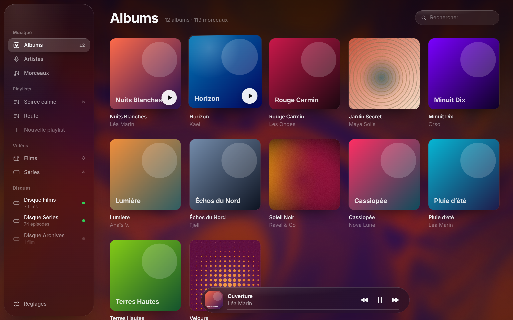

<div align="center">
  
  <h1>Echo</h1>
  <p><strong>My music, movies and shows, all in one place on my Mac.</strong></p>
  <p>
    <a href="https://github.com/Zuko-dlr/Echo/releases/latest"><strong>Download Echo for Mac</strong></a>
    &nbsp;·&nbsp;
    <a href="#install">Install</a>
    &nbsp;·&nbsp;
    <a href="#privacy">Privacy</a>
  </p>
  <sub>macOS 14 or later · Apple silicon · Version 1.2</sub>
</div>

---

## Why I made this

I had music in one place, movies in another and shows on an external drive, and no app I liked for all of it. So I built Echo: one library for everything, without moving any files around.

You pick your folders, Echo finds what's in them and plays it straight from your Mac.

| Music | Movies and shows |
| --- | --- |
| Albums, artists and songs | Movies and episodes from your folders |
| Playlists you can make and reorder | Posters and info from TMDB (optional) |
| Plays the usual audio formats, FLAC included | Plays MP4 and MOV in the app; MKV, AVI and the rest open in Elmedia Player |

External drives get scanned when you plug them in. If you unplug one, your playlists keep their songs.

## Install

1. Grab **Echo for Mac** from [the latest release](https://github.com/Zuko-dlr/Echo/releases/latest).
2. Unzip it and drag `Echo.app` into your `Applications` folder.
3. Open Echo and add your music and video folders in Settings.

### First launch

Echo isn't signed with an Apple Developer ID or notarized, so macOS will probably say it can't verify the developer. That's expected. Only download it from this repo and check that the SHA-256 matches the one on the release page.

To open it the first time, right-click `Echo.app` in Finder, choose **Open** and confirm. On some macOS versions you also have to allow it in **System Settings > Privacy & Security**.

This repo is private, so only people I've invited can see it and download releases. If you want access, send me your GitHub username.

## Privacy

Your music and videos stay on your Mac. Echo never uploads anything. If you add your own TMDB API key in Settings, it'll fetch posters and movie info from TMDB. That part is optional.

Echo doesn't come with any music or videos. You need to already own the files you add.

## Requirements

- A Mac with Apple silicon (M1 or newer)
- macOS 14 Sonoma or later
- About 100 MB for the app, plus some space for cached artwork and posters

## Build it yourself

```sh
./build.sh
```

The app ends up in `build/Echo.app`. It's Swift, AppKit, WebKit and AVFoundation, nothing else to install.

## Credits

Posters and movie info come from the TMDB API. This product uses the TMDB API but is not endorsed or certified by TMDB.
